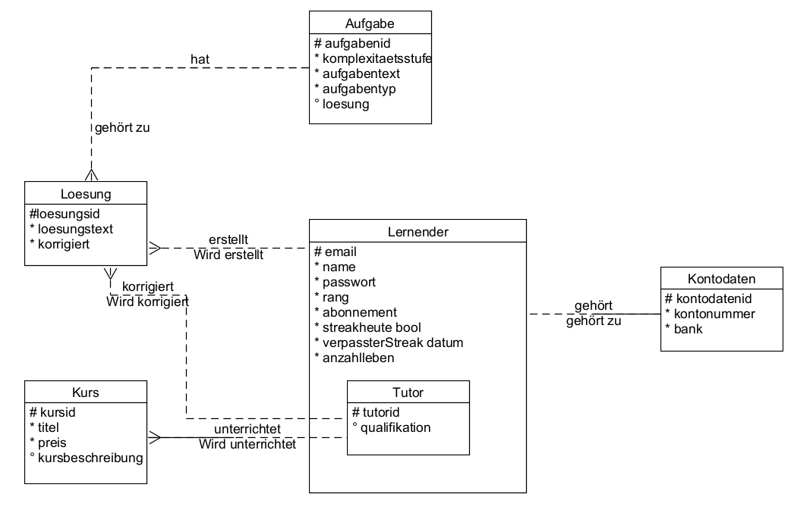

# Anforderungs- und Entwurfsspezifikation ("Pflichtenheft")

# 0 Titelseite

* Autoren:
    * Tobias Wegner
    * Leonie Terlutter
    * Oliver Mann
    * Kevin Zuber
    * Lewin Wanzek
* Link zum Source Code Repository (KOMMT)
    * Datenbank:
    * Server:
    * Webanwendung:
* Inhaltsverzeichnis (KOMMT)

# 1 Einführung

## 1.1 Beschreibung 

#### **Produktname:** Senpai

#### **Beschreibung:**
Senpai ist eine innovative Lernplattform, die sich an Menschen richtet, die Interesse am Programmieren haben, unabhängig von ihrem Erfahrungsniveau. Unser Ziel ist es, Programmierkenntnisse auf unterhaltsame und zugängliche Weise zu vermitteln und gleichzeitig fortgeschrittene Lernmöglichkeiten anzubieten, um das Wissen zu vertiefen und zu festigen.

**Kernfunktionen:**
- **Code Battle:** Fordere dich selbst heraus und messe dich mit anderen in unterhaltsamen Code-Duellen, um dein Wissen spielerisch zu erweitern.
- **Daily Challenge:** Nimm täglich an Herausforderungen teil, um deine Fähigkeiten zu verbessern und eine kontinuierliche Lernroutine aufzubauen.
- **Exercise:** Bearbeite komplexe Aufgaben in verschiedenen Kategorien und erhalte individuelles Feedback von erfahrenen Tutoren, um dein Verständnis zu vertiefen.
- **Accountverwaltung:** Verwalte einfach dein Profil, speichere deine Fortschritte und behalte den Überblick über deine Lernreise.

**Monetarisierung:**
- Kostenlose Nutzung mit begrenzten Funktionen
- Premium-Mitgliedschaft für uneingeschränkten Zugang und individuelles Feedback von Tutoren

**Zielgruppe:**
- Anfänger, die in die Welt des Programmierens eintauchen möchten
- Fortgeschrittene, die ihre Kenntnisse vertiefen und festigen möchten
- Tutoren, die ihr Wissen weitergeben und von der Plattform profitieren möchten

**Warum Senpai:**
Mit einer Kombination aus spielerischen Elementen, täglichen Herausforderungen und individuellem Feedback bietet Senpai eine einzigartige Lernerfahrung, die sowohl motivierend als auch effektiv ist. Egal, ob du gerade erst anfängst oder bereits Erfahrung hast, Senpai begleitet dich auf deiner Reise zum Programmierexperten.

# 2 Anforderungen

## 2.1 Stakeholder

| Funktion / Relevanz | Name             | Kontakt / Verfügbarkeit                 | Wissen                             | Interessen / Ziele                      |
|---------------------|------------------|-----------------------------------------|------------------------------------|-----------------------------------------|
| Product-Owner       | Projektteam      | s. individuelle Mails der Product-Owner |                                    |                                         |
| Serveradministrator | Lewin Wanzek     | Hochschul-Email                         | Grundlegende Kenntnisse JavaScript | Webentwicklung / stabile Serverumgebung |
| Datenbank           | Leonie Terlutter | Hochschul-Email                         |                                    |                                         |
| Webanwendung        | Oliver Mann      | Hochschul-Email                         |                                    |                                         |
| Logik               | Tobias Wegner    | Hochschul-Email                         |                                    |                                         |
| Logik               | Kevin Zuber      | Hochschul-Email                         |                                    |                                         |
| User (extern)       | /                | erreichbar über angelegte Accounts      |                                    |                                         |
| Tutor (extern)      | /                | erreichbar über angelegte Accounts      |                                    |                                         |

## 2.2 Funktionale Anforderungen

* ggfs. Use-Case Diagramme (Kevin)
* Strukturierung der Diagramme in funktionale Gruppen (Kevin)

### Definition der Akteure

**User (Lernender oder Tutor)**

* Lernender:
    * Nutzt die unterschiedlichen Spiel-Modi (konstenlos oder mit dem Abonnemenet-Modell)
* Tutor:
    * Veröffentlicht Inhalte
    * bewertet "Excercise"-Abgaben

**Server**

* Enthält die Spiellogik und regelt die Spielmechanik,
    * Ausführen von Aktionen
    * Aktualisieren des Spielstatus
* Der Server kann
    * Daten abrufen, aktualisieren und löschen
    * Spielaktionen ausführen (Lobbys erstellen, auflösen, Aufgaben verteilen)
    * Spielzustände verwalten

**Datenbank**

* Speichert spielrelevante Informationen
    * Benutzerprofile
    * Spielstände
    * andere spielbezogene Daten

**VsCode (API)**

* Stellt eine Schnittstelle bereit, die es der Webanwendung ermöglicht, Code zu kompilieren
    * Bereitstellung von Methoden und Funktionen zum Einreichen von Code

**ChatGPT (API)**

* Stellt eine Schnittstelle bereit, über die die Einreichungen an die KI gesendet werden können, um sie zu bewerten
    * Bereitstellung von Methoden und Funktionen zum Senden von Texteingaben und zum Empfangen von
      Bewertungsergebnissen.

* Akteure sowie andere Begriffe der implementierten Fachdomäne definieren
* Begriffe konsistent in der Spezifikation verwenden
* Begriffe im Glossar am Ende des Dokuments darstellen

## 2.3 Nicht-funktionale Anforderungen

**Leistungsanforderungen:**
* Benutzerzahl: Die Webanwendung soll für Testzwecke eine geringe Anzahl an parallelen Benutzern zulassen. Wichtig ist, dass eine einfache Skalierung zulässiger Nutzer möglich bleibt.
* Datenumfang: Die Anwendung verfügt über genug Daten, sodass alle Spielmodi funktional lauffähig sind
* Zeitverhalten: Die Webanwendung soll schnelle Reaktionszeit aufweisen, sodass eine flüssige Nutzung der Anwendung möglich wird

**Qualitätsanforderungen:**
* IT-Sicherheit: Die Webanwendung soll nicht von außen beeinflussbar sein, in der Datenbank gespeicherte Daten sind für Außenstehende unzugänglich
* Robustheit: Das System biete für eine längere Periode ein kontinuierliches Spielerlebnis ohne Neustarten zu müssen.

**Realitätsanforderungen:**
* Dokumentation: Sämtlicher Code wird vollständig auf Englisch kommentiert. Ideen werden in den Meeting-Protokollen und als Kanban-Eintrag festgehalten
* Richtlinien: Commit, Kommentierung

### 2.3.1 Rahmenbedingungen

* Das System muss spätestens im Juli (15.07 Beginn der Klausurenphase) fertiggestellt sein

### 2.3.2 Betriebsbedingungen

* Der Kunde kann die Software bequem über den Webbrowser nutzen und ist dabei an kein spezifisches Endgerät gebunden.
  Voraussetzung ist eine stabile Internetverbindung.

### 2.3.3 Qualitätsmerkmale

* Externe Qualitätsanforderungen (z.B. Performance, Sicherheit, Zuverlässigkeit, Benutzerfreundlichkeit)

| Qualitätsmerkmal           | sehr gut | gut | normal | nicht relevant |
|----------------------------|----------|-----|--------|----------------|
| **Zuverlässigkeit**        |          |     |        |                |
| Fehlertoleranz             | -        | -   | X      | -              |
| Wiederherstellbarkeit      | X        | -   | -      | -              |
| Ordnungsmäßigkeit          | -        | -   | X      | -              |
| Richtigkeit                | X        | -   | -      | -              |
| Konformität                | -        | X   | -      | -              |
| **Benutzerfreundlichkeit** |          |     |        |                |
| Installierbarkeit          | -        | -   | -      | X              |
| Verständlichkeit           | X        | -   | -      | -              |
| Erlernbarkeit              | -        | X   | -      | -              |
| Bedienbarkeit              | X        | -   | -      | -              |
| **Performance**            |          |     |        |                |
| Zeitverhalten              | -        | -   | X      | -              |
| Effizienz                  | -        | -   | -      | X              |
| **Sicherheit**             |          |     |        |                |
| Analysierbarkeit           | -        | -   | -      | X              |
| Modifizierbarkeit          | -        | -   | -      | X              |
| Stabilität                 | -        | -   | X      | -              |
| Prüfbarkeit                | -        | X   | -      | -              |

## 2.4 Graphische Benutzerschnittstelle (Mockups einfügen)

#### Startseite

#### Login

#### Auswahl der Lerninhalte (Senpai-Spezifikation)

#### Lernplattform Übersicht

##### Daily-Challenge

**Lückentext**

**Multiple Choice**

##### Code Battles

###### Buzzer

**Lückentext**

**Multiple Choice**

###### Manipulation

**Manipulation Spieler1:**

**Manipulation Spieler2:**

###### Limitation

##### Exercise

**Übersicht**

**Bearbeitung**

* GUI-Mockups passend zu User Stories

* Screens mit Überschrift kennzeichnen, die im Inhaltsverzeichnis zu sehen ist

* Unter den Screens darstellen (bzw. verlinken), welche User Stories mit dem Screen abgehandelt werden

* Modellierung der Navigation zwischen den Screens der GUI-Mockups als Zustandsdiagramm

* Mockups für unterschiedliche Akteure

* Mockups für unterschiedliche Frontends (Mobil, Web, Desktop)

## 2.5 Anforderungen im Detail

#### Benutzerstory 1: Accountverwaltung

**Wer:** Als registrierter Nutzer von Senpai  
**Was:** Möchte ich meinen Account verwalten können.  
**Warum:** Um meine persönlichen Informationen zu aktualisieren, mein Passwort zu ändern und gegebenenfalls meinen Account zu löschen.  
**Wann akzeptiert:** Wenn ich auf meiner Profilseite einfache Optionen zur Bearbeitung meiner Kontoinformationen finde und diese Änderungen nahtlos umgesetzt werden.

#### Benutzerstory 2: Speichern von Login-Daten

**Wer:** Als registrierter Nutzer von Senpai  
**Was:** Möchte ich, dass meine Login-Daten gespeichert werden, damit ich mich nicht jedes Mal neu anmelden muss.  
**Warum:** Um den Anmeldevorgang zu beschleunigen und die Benutzererfahrung zu verbessern.  
**Wann akzeptiert:** Wenn ich die Option habe, meine Anmeldeinformationen zu speichern, und automatisch angemeldet werde, wenn ich die Website erneut besuche.

#### Benutzerstory 3: Anzeige der Lebenspunkte

**Wer:** Als Nutzer von CodeSenpai, der an Code Battles teilnimmt  
**Was:** Möchte ich immer sehen, wie viele "Leben" ich noch habe.  
**Warum:** Um meine verbleibenden Versuche im Auge zu behalten und zu wissen, wann ich weitere "Leben" erwerben muss, um weiterzuspielen.  
**Wann akzeptiert:** Wenn meine verbleibenden "Leben" deutlich auf der Code Battle-Seite angezeigt werden und sich entsprechend aktualisieren, wenn ich weitere "Leben" erwerbe oder verliere.

#### Benutzerstory 4: Einfache Navigation durch Aufgaben

**Wer:** Als Nutzer von CodeSenpai, der Übungen bearbeitet  
**Was:** Möchte ich mich möglichst einfach durch die Aufgaben navigieren können.  
**Warum:** Um effizient zwischen verschiedenen Übungen zu wechseln und meine Zeit effektiv zu nutzen.  
**Wann akzeptiert:** Wenn ich klare Navigationselemente habe, die es mir ermöglichen, zwischen Aufgaben zu wechseln, und wenn die Ladezeiten der Aufgaben minimal sind.

#### Benutzerstory 5: Code-Highlighting

**Wer:** Als Nutzer von CodeSenpai  
**Was:** Möchte ich Code-Highlighting auf der Website haben.  
**Warum:** Um den Code besser lesen und verstehen zu können.
**Wann akzeptiert:** Wenn der Code auf der Website farblich hervorgehoben wird und leicht lesbar ist.

#### Benutzerstory 6: Schnelle Rückmeldung für Übungen

**Wer:** Als Nutzer von CodeSenpai, der Übungen abschließt  
**Was:** Möchte ich möglichst schnell Rückmeldung erhalten (Via KI oder Tutor), wenn ich eine Übung abgeschlossen habe.  
**Warum:** Um zu wissen, ob meine Lösung korrekt ist und um schnell mit dem nächsten Schritt in meiner Lernreise fortzufahren.  
**Wann akzeptiert:** Wenn ich unmittelbar nach dem Einreichen meiner Lösung eine Rückmeldung erhalte und weiß, ob meine Antwort korrekt ist oder nicht.

#### Benutzerstory 7: Historie einsehen

**Wer:** Als Nutzer von CodeSenpai  
**Was:** Möchte ich sehen können, welche Aufgaben ich bereits bearbeitet habe.  
**Warum:** Um meinen Fortschritt zu verfolgen und mich an vergangene Aktivitäten zu erinnern.  
**Wann akzeptiert:** Wenn ich auf meiner Profilseite oder in einer separaten Historie-Seite eine Liste meiner bearbeiteten Aufgaben einsehen kann.

#### Benutzerstory 8: Aufgaben aus Übersicht auswählen

**Wer:** Als Nutzer von CodeSenpai  
**Was:** Möchte ich die Möglichkeit haben, Aufgaben aus einer Übersicht auszuwählen.  
**Warum:** Um gezielt nach bestimmten Aufgaben zu suchen und meine Lernziele effektiv zu verfolgen.  
**Wann akzeptiert:** Wenn ich auf einer Übersichtsseite oder in einer Kategorieauswahl alle verfügbaren Aufgaben sehen und auswählen kann.

#### Benutzerstory 9: Über korrigierte Übungen benachrichtigt werden

**Wer:** Als Nutzer von CodeSenpai, der Übungen einreicht  
**Was:** Möchte ich benachrichtigt werden, wenn meine Übungen korrigiert wurden.  
**Warum:** Um Feedback zu meinen Lösungen zu erhalten und meine Lernfortschritte zu überprüfen.  
**Wann akzeptiert:** Wenn ich eine Benachrichtigung per E-Mail oder auf der Plattform erhalte, sobald meine Übung von einem Tutor korrigiert wurde.

# 3 Technische Beschreibung

## 3.1 Systemübersicht

## 3.2 Softwarearchitektur

* Server
    * Web-Schicht
        * Kommunikation mit den Clients über Web-Sockets
    * Logik-Schicht
        * Abarbeitung der Anfragen über JS Code
    * Persistenz-Schicht
        * Anfrage und Ablage von zu speichernden oder gespeicherten Daten via Datenbank

* Client
    * View-Schicht
        * Web-Anwendung (ggf. PWA) als grafische Interaktionsschnittstelle
    * Logik-Schicht
        * Verwaltung der Logik im JSX basierenden Backend
    * Kommunikation-Schicht
        * Kommunikation mit dem Server via Web-Sockets

### 3.2.1 Technologieauswahl

* Datenbank
    * (noch nicht festgelegt) MySQL, PostgreSQL via Render, NoSql via MongoDB
* Server
    * Javascript-Software, CI/CD via Render, Kommunikation mit Logik-Schicht über Sockets
* Logik-Schicht
    * "Backend", weitergabe von Anfragen über Frontend an den Server, inkorporiert in React.js mit JSX
* Web-Schicht
    * "Frontend", GUI, Benutzerschnittstelle zur Interaktion mit Logikschicht, JSX Software basierend auf React.js,
      gehosted über GithubPages
* Client
    * Interaktion mit Web-Schicht über Frontend

## 3.3 Schnittstellen (Tobi)

* Schnittstellenbeschreibung (API)
* Auflistung der nach außen sichtbaren Schnittstelle der Softwarebausteine

WebSocket-API (socket.io)
ChatGPT API
Visual Studio API

Hier sollen sämtliche Schnittstellen definiert werden:

* die externen Schnittstellen nach außen. Über welche Schnittstelle kann z.B. der Client den Server erreichen?
* die internen Schnittstellen der unter 3.2 definierten Softwarebausteine

Es ist sinnvoll, wenn die API von denjenigen definiert werden, die die Anforderungen an die API kennen: in einem
Client-Server-System haben die Client-Entwickler Anforderungen an die Backend-Entwickler, so dass in diesem Fall die
Client-Entwickler die API definieren sollten, die dann vom Backend-Entwickler implementiert werden.

## 3.3 Datenmodell

**Vorläufiges ER-Diagramm (V1)**

* Konzeptionelles Analyseklassendiagramm (logische Darstellung der Konzepte der Anwendungsdomäne)
* Modellierung des physikalischen Datenmodells
* RDBMS: ER-Diagramm bzw. Dokumentenorientiert: JSON-Schema

## 3.4 Abläufe (folgt)

* Aktivitätsdiagramme für relevante Use Cases

* Aktivitätsdiagramm für den Ablauf sämtlicher Use Cases
* Aktivitätsdiagramm mit Swimlanes sind in der Regel hilfreich für die Darstellung der Interaktion von Akteuren der Use
  Cases / User Stories

* Abläufe der Kommunikation von Rechnerknoten (z.B. Client/Server)
  in einem Sequenz- oder Aktivitätsdiagramm darstellen

* Modellieren Sie des weiteren die Diagramme, die für das (eigene) Verständnis des
  Softwaresystems hilfreich sind.

## 3.5 Entwurf (folgt)

## 3.6 Fehlerbehandlung

Auflistung möglicher Fehler / Exceptions

* Login:
    * Account nicht gefunden (Rechtschreibfehler, nicht registriert)
    * Das eingegebene Passwort ist falsch

* Registrierung:
    * E-Mail bereits vergeben
    * Accountname vergeben
    * Passwort erfüllt nicht die Anforderungen

* Spiele:
    * Weiterspielen trotz aufgebrauchter Leben
    * User-Interaktionen entgegengesetzt der Spielregeln
    * Gegenspieler verlässt das Spiel
    * Verbindung wird unterbrochen
    * Streak der Daily Challenge wird automatisch fortgeführt

* Fehlercodes: (folgt)

## 3.7 Validierung (folgt)

* Relevante (Integrations)-Testfälle, die aus den Use Cases abgeleitet werden können

* Testfälle für

* Datenmodell

* API

* User Interface

* Fokussieren Sie mehr auf Integrationstestfälle als auf Unittests

Es bietet sich an, die IDs der Use Cases / User Stories mit den Testfällen zu verbinden, sodass erkennbar ist, ob Sie
alle Use Cases getestet haben.

# 4 Projektorganisation

## 4.1 Annahmen

* Verwendete Technologien (Programmiersprache, Frameworks, etc.)
    * socket.io
    * node.js
    * react.js
    * MySql / MongoDB / PostgreSQL
    * JS
    * JSX
    * GithubPages
    * render

* Aufteilung in Repositories gemäß Software- und Systemarchitektur und Softwarebausteinen
    * Organisations Repo
    * Server Repo
    * Frontend/Backend Repo
    * Datenbank

* Einschränkungen, Betriebsbedingungen und Faktoren, die die Entwicklung beeinflussen (Betriebssysteme,
  Entwicklungsumgebung)
    * Einarbeitung in unbekannte Frameworks, Libraries, Web-Dienste

* Interne Qualitätsanforderungen (z.B. Softwarequalitätsmerkmale wie z.B. Erweiterbarkeit)
    * möglichst einfache Erweiterung der Anwendung um neue Themenbereiche, Lerninhalte, Spielmodi

## 4.2 Verantwortlichkeiten

* Zuordnung von Personen zu Softwarebausteinen aus Kapitel "Systemübersicht" und "Softwarearchitektur"

* Rollendefinition und Zuordnung

| Softwarebaustein | Person(en)    |
|------------------|---------------|
| Server           | Lewin         |
| Datenbank        | Leonie        |
| Backend          | Tobias, Kevin |
| Frontend         | Oliver        |

### Rollen

Überlegen Sie, ob es sinnvoll ist, wenn Sie die Rollen für
Product-Owner und Scrum-Master vergeben, wobei Sie bedenken
sollten, ob diese Rollen über den gesamten Projektzeitraum
aktiv sein werden. Neben diesen Rollen können folgende Rollen
sinnvoll sein:

#### Softwarearchitekt

Entwirft den Aufbau von Softwaresystemen und trifft Entscheidungen über das Zusammenspiel der Softwarebausteine.

#### Frontend-Entwickler

Entwickelt graphische oder andere Benutzerschnittstellen, insbesondere das Layout einer
Anwendung.

#### Backend-Entwickler

Implementiert die funktionale Logik der Anwendung. Hierbei werden zudem diverse Datenquellen und externe Dienste
integriert und für die Anwendung bereitgestellt.

#### DevOps-Engineer

Ist für die Repositories und das Deployment verantwortlich.

### Rollenzuordnung

| Name   | Rolle               |
|--------|---------------------|
| Lewin  | Projektleiter       |
| Tobias | DevOps-Engineer     |
| Kevin  | Scrum-Master        |

## 4.3 Grober Projektplan

### Meilensteine

* KW 18 (29.04)
  * Abgabe Pflichtenheft

* KW ()
  * Repositories und Projekte für Entwicklung aufsetzen

* KW ()
  * Grundlegende Kommunikation
    * Verbindung zwischen Server und Datenbank
    * Verbindung zwischen Server und Web-Anwendung

* KW 23 (03.06)
  * Mitte der Projektbearbeitungszeit

* KW ()
  * Erreichung des MVP (Minimal Viable Product)

* KW ()
  * Einbindung weiteren APIs
    * ChatGPT API
    * Visual Studio API

* KW 28 (08.07)
  * Fertigstellung des Projektes
  * Debugging

* KW 29 (15.07)
  * Ende der Projektlaufzeit
  * Präsentation / Software-Demo

**weitere Meilensteine:** anwendungsspezifische Features

# 5 Anhänge

## 5.1 Glossar

* Definitionen, Abkürzungen, Begriffe

## 5.2 Referenzen

* Handbücher, Gesetze

## 5.3 Index