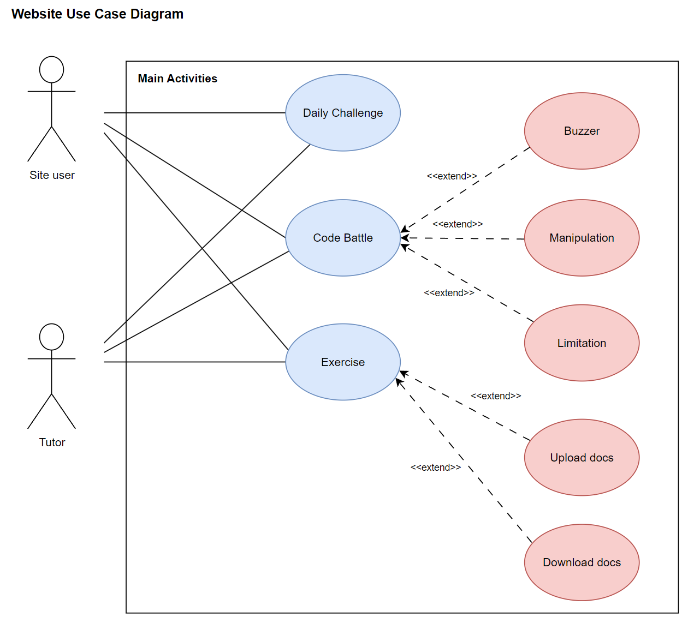
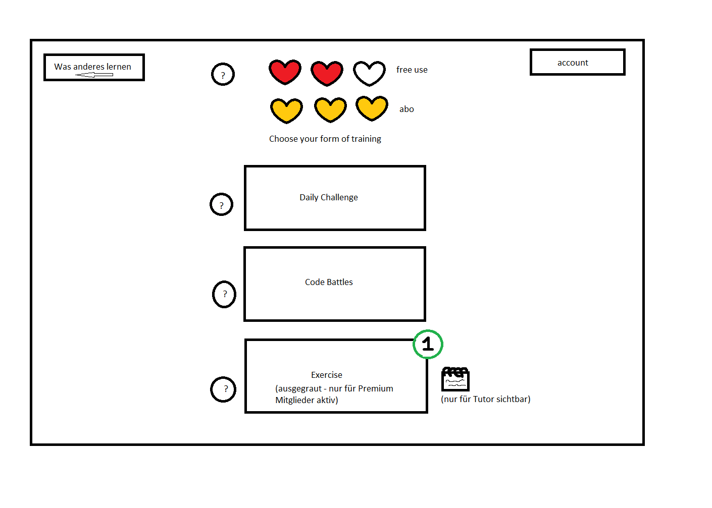
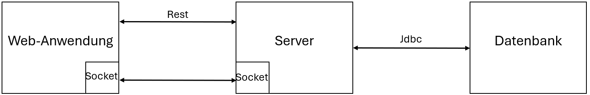
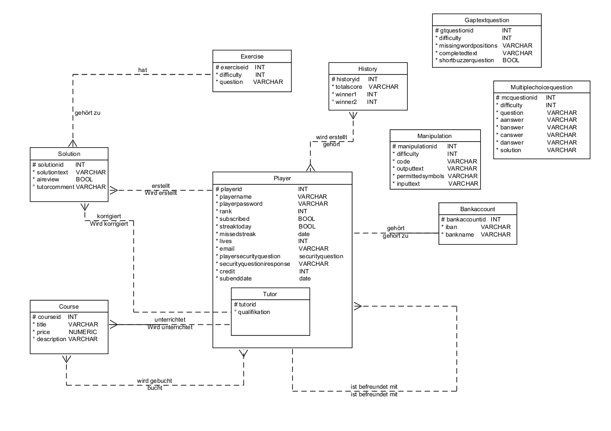

# Anforderungs- und Entwurfsspezifikation ("Pflichtenheft")

# 0 Titelseite

* Autoren:
    * Tobias Wegner
    * Leonie Terlutter
    * Oliver Mann
    * Kevin Zuber
    * Lewin Wanzek
* Link zum Source Code Repository
    * Organisation: https://github.com/Team-A4-Softwareprojekt/OrgaUndDokuA4
    * Backend: https://github.com/Team-A4-Softwareprojekt/Senpai-Backend
    * Frontend: https://github.com/Team-A4-Softwareprojekt/Senpai-Frontend
* Inhaltsverzeichnis (KOMMT)

# 1 Einführung

## 1.1 Beschreibung

#### **Produktname:** Senpai

#### **Beschreibung:**

Senpai ist eine innovative Lernplattform, die sich an Menschen richtet, die Interesse am Programmieren haben, unabhängig
von ihrem Erfahrungsniveau. Unser Ziel ist es, Programmierkenntnisse auf unterhaltsame und zugängliche Weise zu
vermitteln und gleichzeitig fortgeschrittene Lernmöglichkeiten anzubieten, um das Wissen zu vertiefen und zu festigen.

**Kernfunktionen:**

- **Code Battle:** Fordere dich selbst heraus und messe dich mit anderen in unterhaltsamen Code-Duellen, um dein Wissen
  spielerisch zu erweitern.
- **Daily Challenge:** Nimm täglich an Herausforderungen teil, um deine Fähigkeiten zu verbessern und eine
  kontinuierliche Lernroutine aufzubauen.
- **Exercise *(Optional)*:** Bearbeite komplexe Aufgaben in verschiedenen Kategorien und erhalte individuelles Feedback
  von
  erfahrenen Tutoren, um dein Verständnis zu vertiefen.
- **Accountverwaltung:** Verwalte einfach dein Profil, speichere deine Fortschritte und behalte den Überblick über deine
  Lernreise.

**Monetarisierung:**

- Kostenlose Nutzung mit begrenzten Funktionen
- Premium-Mitgliedschaft für uneingeschränkten Zugang und individuelles Feedback von Tutoren

**Zielgruppe:**

- Anfänger, die in die Welt des Programmierens eintauchen möchten
- Fortgeschrittene, die ihre Kenntnisse vertiefen und festigen möchten
- *(Optional)* Tutoren, die ihr Wissen weitergeben und von der Plattform profitieren möchten

**Warum Senpai:**
Mit einer Kombination aus spielerischen Elementen, täglichen Herausforderungen und individuellem Feedback bietet Senpai
eine einzigartige Lernerfahrung, die sowohl motivierend als auch effektiv ist. Egal, ob du gerade erst anfängst oder
bereits Erfahrung hast, Senpai begleitet dich auf deiner Reise zum Programmierexperten.

# 2 Anforderungen

## 2.1 Stakeholder

| Funktion / Relevanz | Name             | Kontakt / Verfügbarkeit                 | Wissen                                                 | Interessen / Ziele                                                                        |
|---------------------|------------------|-----------------------------------------|--------------------------------------------------------|-------------------------------------------------------------------------------------------|
| Product-Owner       | Projektteam      | s. individuelle Mails der Product-Owner |                                                        |                                                                                           |
| Serveradministrator | Lewin Wanzek     | Hochschul-Email                         | Grundlegende Kenntnisse JavaScript                     | Webentwicklung / stabile Serverumgebung                                                   |
| Datenbank           | Leonie Terlutter | Hochschul-Email                         |                                                        |                                                                                           |
| Webanwendung        | Oliver Mann      | Hochschul-Email                         |                                                        |                                                                                           |
| Webanwendung        | Tobias Wegner    | Hochschul-Email                         | Grundlegende Kenntnisse GitHub verwaltung / JavaScript | Vertiefung Repository/Organisations verwaltung, Gute Planung zur Vorbeugung von Problemen |
| Webanwendung        | Kevin Zuber      | Hochschul-Email                         |                                                        |                                                                                           |
| User (extern)       | /                | erreichbar über angelegte Accounts      |                                                        |                                                                                           |
| Tutor (extern)      | /                | erreichbar über angelegte Accounts      |                                                        |                                                                                           |

## 2.2 Funktionale Anforderungen

#### Account

#### Activities

#### Payment

### Definition der Akteure

**User (Lernender oder Tutor)**

* Lernender:
    * Nutzt die unterschiedlichen Spiel-Modi (konstenlos oder mit dem Abonnemenet-Modell)
* *(Optional)* Tutor:
    * Veröffentlicht Inhalte
    * bewertet "Excercise"-Abgaben

**Server**

* Enthält die Spiellogik und regelt die Spielmechanik,
    * Ausführen von Aktionen
    * Aktualisieren des Spielstatus
* Der Server kann
    * Daten abrufen, aktualisieren und löschen
    * Spielaktionen ausführen (Lobbys erstellen, auflösen, Aufgaben verteilen)
    * Spielzustände verwalten

**Datenbank**

* Speichert spielrelevante Informationen
    * Benutzerprofile
    * Spielstände
    * andere spielbezogene Daten

**ACE Code Editor (API)**

* Stellt eine Schnittstelle bereit, die es ermöglicht den Code Editor in die Webanwendung zu implementierung
    * entspricht den Funktionen und der Leistung nativer Editoren

***(Optional)* ChatGPT (API)**

* Stellt eine Schnittstelle bereit, über die die Einreichungen an die KI gesendet werden können, um sie zu bewerten
    * Bereitstellung von Methoden und Funktionen zum Senden von Texteingaben und zum Empfangen von
      Bewertungsergebnissen.

## 2.3 Nicht-funktionale Anforderungen

**Leistungsanforderungen:**

* Benutzerzahl: Die Webanwendung soll für Testzwecke eine geringe Anzahl an parallelen Benutzern zulassen. Wichtig ist,
  dass eine einfache Skalierung zulässiger Nutzer möglich bleibt.
* Datenumfang: Die Anwendung verfügt über genug Daten, sodass alle Spielmodi funktional lauffähig sind
* Zeitverhalten: Die Webanwendung soll schnelle Reaktionszeit aufweisen, sodass eine flüssige Nutzung der Anwendung
  möglich wird

**Qualitätsanforderungen:**

* IT-Sicherheit: Die Webanwendung soll nicht von außen beeinflussbar sein, in der Datenbank gespeicherte Daten sind für
  Außenstehende unzugänglich
* Robustheit: Das System biete für eine längere Periode ein kontinuierliches Spielerlebnis ohne Neustarten zu müssen.

**Realitätsanforderungen:**

* Dokumentation: Sämtlicher Code wird vollständig auf Englisch kommentiert. Ideen werden in den Meeting-Protokollen und
  als Kanban-Eintrag festgehalten
* Richtlinien: Commit, Kommentierung

### 2.3.1 Rahmenbedingungen

* Das System muss spätestens im Juli (15.07 Beginn der Klausurenphase) fertiggestellt sein

### 2.3.2 Betriebsbedingungen

* Der Kunde kann die Software bequem über den Webbrowser nutzen und ist dabei an kein spezifisches Endgerät gebunden.
  Voraussetzung ist eine stabile Internetverbindung.

### 2.3.3 Qualitätsmerkmale

* Externe Qualitätsanforderungen (z.B. Performance, Sicherheit, Zuverlässigkeit, Benutzerfreundlichkeit)

| Qualitätsmerkmal           | sehr gut | gut | normal | nicht relevant |
|----------------------------|----------|-----|--------|----------------|
| **Zuverlässigkeit**        |          |     |        |                |
| Fehlertoleranz             | -        | -   | X      | -              |
| Wiederherstellbarkeit      | X        | -   | -      | -              |
| Ordnungsmäßigkeit          | -        | -   | X      | -              |
| Richtigkeit                | X        | -   | -      | -              |
| Konformität                | -        | X   | -      | -              |
| **Benutzerfreundlichkeit** |          |     |        |                |
| Installierbarkeit          | -        | -   | -      | X              |
| Verständlichkeit           | X        | -   | -      | -              |
| Erlernbarkeit              | -        | X   | -      | -              |
| Bedienbarkeit              | X        | -   | -      | -              |
| **Performance**            |          |     |        |                |
| Zeitverhalten              | -        | -   | X      | -              |
| Effizienz                  | -        | -   | -      | X              |
| **Sicherheit**             |          |     |        |                |
| Analysierbarkeit           | -        | -   | -      | X              |
| Modifizierbarkeit          | -        | -   | -      | X              |
| Stabilität                 | -        | -   | X      | -              |
| Prüfbarkeit                | -        | X   | -      | -              |

## 2.4 Graphische Benutzerschnittstelle

#### Startseite

#### Login

#### Auswahl der Lerninhalte (Senpai-Spezifikation)

#### Lernplattform Übersicht

#### Aufgaben Übersicht

##### Daily-Challenge

**Lückentext**

**Multiple Choice**

##### Code Battles

###### Buzzer

**Lückentext**

**Multiple Choice**

###### Manipulation

**Manipulation Spieler1:**

**Manipulation Spieler2:**

###### Limitation

##### Exercise

**Übersicht**

**Bearbeitung**

#### Account

#### Navigation zwischen den Screens

## 2.5 Anforderungen im Detail

#### Benutzerstory 1: Accountverwaltung

**Wer:** Als registrierter Nutzer von Senpai  
**Was:** Möchte ich meinen Account verwalten können.  
**Warum:** Um meine persönlichen Informationen zu aktualisieren, mein Passwort zu ändern und gegebenenfalls meinen
Account zu löschen.  
**Wann akzeptiert:** Wenn ich auf meiner Profilseite einfache Optionen zur Bearbeitung meiner Kontoinformationen finde
und diese Änderungen nahtlos umgesetzt werden.

#### Benutzerstory 2: Speichern von Login-Daten

**Wer:** Als registrierter Nutzer von Senpai  
**Was:** Möchte ich, dass meine Login-Daten gespeichert werden, damit ich mich nicht jedes Mal neu anmelden muss.  
**Warum:** Um den Anmeldevorgang zu beschleunigen und die Benutzererfahrung zu verbessern.  
**Wann akzeptiert:** Wenn ich die Option habe, meine Anmeldeinformationen zu speichern, und automatisch angemeldet
werde, wenn ich die Website erneut besuche.

#### Benutzerstory 3: Anzeige der Lebenspunkte

**Wer:** Als Nutzer von CodeSenpai, der an Code Battles teilnimmt  
**Was:** Möchte ich immer sehen, wie viele "Leben" ich noch habe.  
**Warum:** Um meine verbleibenden Versuche im Auge zu behalten und zu wissen, wann ich weitere "Leben" erwerben muss, um
weiterzuspielen.  
**Wann akzeptiert:** Wenn meine verbleibenden "Leben" deutlich auf der Code Battle-Seite angezeigt werden und sich
entsprechend aktualisieren, wenn ich weitere "Leben" erwerbe oder verliere.

#### Benutzerstory 4: Einfache Navigation durch Aufgaben

**Wer:** Als Nutzer von CodeSenpai, der Übungen bearbeitet  
**Was:** Möchte ich mich möglichst einfach durch die Aufgaben navigieren können.  
**Warum:** Um effizient zwischen verschiedenen Übungen zu wechseln und meine Zeit effektiv zu nutzen.  
**Wann akzeptiert:** Wenn ich klare Navigationselemente habe, die es mir ermöglichen, zwischen Aufgaben zu wechseln, und
wenn die Ladezeiten der Aufgaben minimal sind.

#### Benutzerstory 5: Code-Highlighting

**Wer:** Als Nutzer von CodeSenpai  
**Was:** Möchte ich Code-Highlighting auf der Website haben.  
**Warum:** Um den Code besser lesen und verstehen zu können.
**Wann akzeptiert:** Wenn der Code auf der Website farblich hervorgehoben wird und leicht lesbar ist.

#### *(Optional)* Benutzerstory 6: Schnelle Rückmeldung für Übungen

**Wer:** Als Nutzer von CodeSenpai, der Übungen abschließt  
**Was:** Möchte ich möglichst schnell Rückmeldung erhalten (Via KI oder Tutor), wenn ich eine Übung abgeschlossen
habe.  
**Warum:** Um zu wissen, ob meine Lösung korrekt ist und um schnell mit dem nächsten Schritt in meiner Lernreise
fortzufahren.  
**Wann akzeptiert:** Wenn ich unmittelbar nach dem Einreichen meiner Lösung eine Rückmeldung erhalte und weiß, ob meine
Antwort korrekt ist oder nicht.

#### *(Optional)* Benutzerstory 7: Historie einsehen

**Wer:** Als Nutzer von CodeSenpai  
**Was:** Möchte ich sehen können, welche Aufgaben ich bereits bearbeitet habe.  
**Warum:** Um meinen Fortschritt zu verfolgen und mich an vergangene Aktivitäten zu erinnern.  
**Wann akzeptiert:** Wenn ich auf meiner Profilseite oder in einer separaten Historie-Seite eine Liste meiner
bearbeiteten Aufgaben einsehen kann.

#### *(Optional)* Benutzerstory 8: Aufgaben aus Übersicht auswählen

**Wer:** Als Nutzer von CodeSenpai  
**Was:** Möchte ich die Möglichkeit haben, Aufgaben aus einer Übersicht auszuwählen.  
**Warum:** Um gezielt nach bestimmten Aufgaben zu suchen und meine Lernziele effektiv zu verfolgen.  
**Wann akzeptiert:** Wenn ich auf einer Übersichtsseite oder in einer Kategorieauswahl alle verfügbaren Aufgaben sehen
und auswählen kann.

#### *(Optional)* Benutzerstory 9: Über korrigierte Übungen benachrichtigt werden

**Wer:** Als Nutzer von CodeSenpai, der Übungen einreicht  
**Was:** Möchte ich benachrichtigt werden, wenn meine Übungen korrigiert wurden.  
**Warum:** Um Feedback zu meinen Lösungen zu erhalten und meine Lernfortschritte zu überprüfen.  
**Wann akzeptiert:** Wenn ich eine Benachrichtigung per E-Mail oder auf der Plattform erhalte, sobald meine Übung von
einem Tutor korrigiert wurde.

## 2.6 Design Richtlinien

Das Design wird passend zum Namen "Senpai" an die asiatische Kultur angelehnt sein.

* Hintergrundfarbe
* Schriftart
* Format
* Interaktionsmöglichkeiten (Größe, Position, Sichtbarkeit)

# 3 Technische Beschreibung

## 3.1 Systemübersicht

## 3.2 Softwarearchitektur

#### Drei-Schichten-Architektur:

**Präsentationsschicht:**

- Web-Anwendung (*optional* PWA) als grafische Interaktionsschnittstelle
- Es wird die Open-Source JavaScript Bibliothek React.js verwendet, um die Benutzeroberfläche und
  dessen Interaktion zu implementieren
- kommuniziert über Web-sockets mit der Logik-Schicht
- Website wird gehostet über Github-Pages
- kein direkter Zugriff auf die Datenbank

**Logik-Schicht:**

- hierfür wird ebenfalls JavaScript mittels Node.js verwendet, um die Server-funktionalität zu stellen
- reagiert über Web-sockets auf Anfragen der Präsentationsschicht
- Serverfunktionalität wird gehostet auf Render.com
- zugriff auf Datenbank

**Datenzugriffsschicht:**

- DBeaver wird zur Verwaltung der Datenbank verwendet, die Datenbank wird über SQL Skripte erstellt
- nur der Server kommuniziert mit der Datenbank

### 3.2.1 Technologieauswahl

**Client:**

* React.js (JavaScript und XML (JSX))
* Render
* Socket.io (Kommunikation zum Server, Spielkommunikation)
* Rest-API (Kommunikation zum Server, Laden von userbezogenen Daten)
* CI/CD durch GitHub (Actions/Workflows) und Render 

**Server:**

* Node.js (JavaScript),
* Render
* Socket.io (Kommunikation zum Client)
* Rest-API (Kommunikation zum Client, Bereitstellung userbezogener Daten aus der Datenbank)
* CI/CD durch GitHub (Actions/Workflows) und Render

**Datenbank:**

* PostgreSQL Datenbank, gehostet auf Render
* DBeaver für die Verwaltung der Datenbank

## 3.3 Schnittstellen-Technologien

**WebSocket-API (socket.io):**

Damit Client und Server in Echtzeit kommunizieren können, werden WebSockets eingesetzt. Diese Echtzeitkommunikation ist
entscheidend, um eine faire und konsistente Spielerfahrung sicherzustellen. Socket.io stellt eine performante und
zuverlässige Lösung dar, die zudem gut dokumentiert und leicht verständlich ist. Sie ermöglicht es Entwicklern,
effizient robuste Echtzeit-Anwendungen zu entwickeln, sei es für Multiplayer-Spiele, Live-Dashboards oder andere
Anwendungen, die schnelle und zuverlässige Echtzeit-Datenübertragung erfordern.

https://socket.io/

**Rest-API (Representational State Transfer):**

Um Daten aus der Datenbank abzurufen, wird eine REST API verwendet. Diese API ermöglicht es, effizient und zuverlässig
auf die benötigten Daten zuzugreifen, ohne dass eine Echtzeitkommunikation erforderlich ist. RESTful APIs sind weit
verbreitet und gut dokumentiert, was die Integration und Wartung erleichtert. Sie bieten eine standardisierte Methode,
um Daten über HTTP zu übertragen, und eignen sich hervorragend für Anwendungen, bei denen Daten abgerufen oder
aktualisiert werden müssen, aber keine sofortige Rückmeldung in Echtzeit erforderlich ist.

https://socket.io/

***(Optional)* GPT API:**

Die API von ChatGPT ermöglicht die Integration der KI in eigene Softwareprojekte und bietet somit vielfältige
Einsatzmöglichkeiten. In diesem Projekt soll die KI möglicherweise genutzt werden, um automatisierte Korrekturen der
Übungen zu ermöglichen. Diese Funktion könnte Lehrern und Ausbildern helfen, Zeit zu sparen und gleichzeitig den
Lernenden sofortiges Feedback zu ihren Aufgaben zu geben. Durch den Einsatz der ChatGPT-API können Fehler schneller
erkannt und korrigiert werden, wodurch die Effizienz des Lernprozesses gesteigert wird. Zudem lässt sich die API
flexibel an die spezifischen Anforderungen des Projekts anpassen, um optimale Ergebnisse zu erzielen.

https://openai.com/product

https://chatgpt-info.de/chatgpt-in-website-einbinden-schritt-fuer-schritt-anleitung/

https://www.ionos.de/digitalguide/websites/web-entwicklung/chatgpt-api/

**ACE Code Editor API:**

ACE ist ein Open-Source "High Performance Code Editor for the Web", der sich durch seine Leistungsfähigkeit und
Flexibilität auszeichnet. Der Editor kann problemlos in jede Website oder JavaScript-Anwendung integriert werden,
wodurch er vielseitig einsetzbar ist.

Der Open-Source-Code von ACE ist auf GitHub verfügbar:
https://ace.c9.io/

Die offizielle Website bietet ausführliche Anleitungen und dokumentiert die einfache Integration des Editors:
https://github.com/ajaxorg/ace

In unseren Spielmodi (Manipulation und *(optional)* Limitation) verwenden wir den ACE-Code-Editor, um Client-seitiges Kompilieren zu ermöglichen und so ein
interaktives "Coding-Erlebnis" auf unserer Lernplattform zu schaffen. Diese Integration bietet den Nutzern die
Möglichkeit, direkt im Browser zu programmieren, was das Lernen von Programmiersprachen und das Verständnis von
Codekonzepten erleichtert. Durch die Nutzung des ACE-Editors können wir eine nahtlose und leistungsstarke
Coding-Umgebung bieten, die sowohl Anfänger als auch fortgeschrittene Benutzer anspricht.

ACE unterstützt verschiedene Programmiersprachen, bietet Syntax-Highlighting, Autovervollständigung und eine Vielzahl
von Anpassungsoptionen, die es ermöglichen, den Editor an die spezifischen Bedürfnisse unserer Nutzer anzupassen. Mit
seiner benutzerfreundlichen Oberfläche und der robusten Funktionalität trägt der ACE-Code-Editor maßgeblich dazu bei,
die Interaktivität und Effektivität unserer Lernplattform zu steigern.

**Datenbank:**

Um auf die PostgreSQL-Datenbank zuzugreifen, können IDE-bezogene Erweiterungen (Extensions) verwendet werden. Diese
Tools erleichtern die Verwaltung und Interaktion mit der Datenbank direkt innerhalb der Entwicklungsumgebung. Dazu wird
die Datenbankverbindung im Code hinterlegt, was eine nahtlose Integration ermöglicht.

Die Verwendung solcher Erweiterungen bietet zahlreiche Vorteile: Sie ermöglichen eine komfortable Verwaltung von
Datenbank-Schemata, die Durchführung von SQL-Abfragen und die Überwachung der Datenbankleistung. Zudem unterstützen
viele dieser Tools die Autovervollständigung von SQL-Befehlen und bieten Syntax-Highlighting, was die Produktivität und
Genauigkeit beim Arbeiten mit der Datenbank erhöht. Durch die Integration der Datenbankverbindung in den Code wird
sichergestellt, dass die Anwendung jederzeit effizient und sicher auf die benötigten Daten zugreifen kann.

## 3.4 Ausformulierung der Schnittstellen

### Laden userbezogener Daten via Rest-API:

* * *

#### 1. Benutzerregistrierung

**Endpunkt:** `/register`

**Methode:** `POST`

**Beschreibung:** Diese Funktion registriert einen neuen Benutzer. Es wird überprüft, ob der Benutzername oder die E-Mail bereits existieren. Wenn nicht, wird ein neuer Benutzer mit gehashtem Passwort in die Datenbank eingefügt.

**Anfrage-Parameter:**
- `username` (String, erforderlich)
- `email` (String, erforderlich)
- `password` (String, erforderlich)
- `securityQuestion` (String, erforderlich)
- `securityAnswer` (String, erforderlich)

**Antworten:**
- `201 Created` - Registrierung erfolgreich
- `409 Conflict` - Benutzername oder E-Mail existieren bereits
- `500 Internal Server Error` - Datenbankfehler

* * *

#### 2. Benutzeranmeldung

**Endpunkt:** `/login`

**Methode:** `POST`

**Beschreibung:** Diese Funktion ermöglicht die Anmeldung eines Benutzers durch Überprüfung von Benutzernamen und Passwort.

**Anfrage-Parameter:**
- `username` (String, erforderlich)
- `password` (String, erforderlich)

**Antworten:**
- `200 OK` - Anmeldung erfolgreich
- `401 Unauthorized` - Ungültige Anmeldedaten
- `500 Internal Server Error` - Datenbankfehler

* * *

#### 3. Sicherheitsfragen abrufen

**Endpunkt:** `/security-questions`

**Methode:** `GET`

**Beschreibung:** Diese Funktion ruft alle verfügbaren Sicherheitsfragen aus der Datenbank ab.

**Antworten:**
- `200 OK` - Erfolgreiche Abfrage
- `500 Internal Server Error` - Datenbankfehler

* * *

#### 4. Verbindungstest

**Endpunkt:** `/connection_test`

**Methode:** `GET`

**Beschreibung:** Diese Funktion testet die Verbindung durch Überprüfung eines Testdatums.

**Anfrage-Parameter:**
- `data` (String, erforderlich)

**Antworten:**
- `200 OK` - Verbindung erfolgreich (`true` oder `false`)

* * *

#### 5. Kontodaten laden

**Endpunkt:** `/loadAccountData`

**Methode:** `POST`

**Beschreibung:** Diese Funktion lädt die Kontodaten eines Benutzers basierend auf dem Benutzernamen.

**Anfrage-Parameter:**
- `playerName` (String, erforderlich)

**Antworten:**
- `200 OK` - Kontodaten erfolgreich geladen
- `404 Not Found` - Benutzer nicht gefunden
- `500 Internal Server Error` - Datenbankfehler

* * *

#### 6. E-Mail-Adresse ändern

**Endpunkt:** `/changeEmail`

**Methode:** `POST`

**Beschreibung:** Diese Funktion ändert die E-Mail-Adresse eines Benutzers.

**Anfrage-Parameter:**
- `playerName` (String, erforderlich)
- `newEmail` (String, erforderlich)

**Antworten:**
- `200 OK` - E-Mail erfolgreich geändert
- `404 Not Found` - Benutzer nicht gefunden
- `500 Internal Server Error` - Datenbankfehler

* * *

#### 7. Passwort ändern

**Endpunkt:** `/changePassword`

**Methode:** `POST`

**Beschreibung:** Diese Funktion ändert das Passwort eines Benutzers.

**Anfrage-Parameter:**
- `playerName` (String, erforderlich)
- `newPassword` (String, erforderlich)

**Antworten:**
- `200 OK` - Passwort erfolgreich geändert
- `404 Not Found` - Benutzer nicht gefunden
- `500 Internal Server Error` - Datenbankfehler

* * *

#### 8. Abonnement starten

**Endpunkt:** `/startSubscription`

**Methode:** `POST`

**Beschreibung:** Diese Funktion startet ein Abonnement für einen Benutzer und reduziert das Guthaben um 5 Credits.

**Anfrage-Parameter:**
- `playerName` (String, erforderlich)
- `subEndDate` (String, erforderlich)

**Antworten:**
- `200 OK` - Abonnement erfolgreich gestartet
- `404 Not Found` - Nicht genügend Guthaben
- `500 Internal Server Error` - Datenbankfehler

* * *

#### 9. Konto löschen

**Endpunkt:** `/deleteAccount`

**Methode:** `POST`

**Beschreibung:** Diese Funktion löscht das Konto eines Benutzers.

**Anfrage-Parameter:**
- `playerName` (String, erforderlich)

**Antworten:**
- `200 OK` - Konto erfolgreich gelöscht
- `404 Not Found` - Benutzer nicht gefunden
- `500 Internal Server Error` - Datenbankfehler

* * *

#### 10. Passwort vergessen

**Endpunkt:** `/forgotPassword`

**Methode:** `POST`

**Beschreibung:** Diese Funktion setzt das Passwort eines Benutzers zurück, wenn die Sicherheitsfrage korrekt beantwortet wird.

**Anfrage-Parameter:**
- `email` (String, erforderlich)
- `password` (String, erforderlich)
- `securityQuestion` (String, erforderlich)
- `securityAnswer` (String, erforderlich)

**Antworten:**
- `200 OK` - Passwort erfolgreich zurückgesetzt
- `404 Not Found` - Ungültige Angaben
- `500 Internal Server Error` - Datenbankfehler

* * *

#### 11. Abonnement kündigen

**Endpunkt:** `/cancelSubscription`

**Methode:** `POST`

**Beschreibung:** Diese Funktion kündigt das Abonnement eines Benutzers.

**Anfrage-Parameter:**
- `playerName` (String, erforderlich)

**Antworten:**
- `200 OK` - Abonnement erfolgreich gekündigt
- `404 Not Found` - Benutzer nicht gefunden
- `500 Internal Server Error` - Datenbankfehler

* * *

#### 12. Guthaben kaufen

**Endpunkt:** `/buyCurrency`

**Methode:** `POST`

**Beschreibung:** Diese Funktion erhöht das Guthaben eines Benutzers.

**Anfrage-Parameter:**
- `playerName` (String, erforderlich)
- `amount` (Integer, erforderlich)

**Antworten:**
- `200 OK` - Guthaben erfolgreich erhöht
- `404 Not Found` - Benutzer nicht gefunden
- `500 Internal Server Error` - Datenbankfehler

* * *

#### 13. Tagesstreak abschließen

**Endpunkt:** `/streakForToday`

**Methode:** `POST`

**Beschreibung:** Diese Funktion markiert den täglichen Streak eines Benutzers als abgeschlossen.

**Anfrage-Parameter:**
- `playerName` (String, erforderlich)

**Antworten:**
- `200 OK` - Tagesstreak erfolgreich abgeschlossen
- `404 Not Found` - Benutzer nicht gefunden
- `500 Internal Server Error` - Datenbankfehler

* * *

### Echtzeit Kommunikation mit SocketIO:

### Daily Challenge

#### 1. REQUEST_DAILY_CHALLENGE_QUESTION Event
**Event:** `REQUEST_DAILY_CHALLENGE_QUESTION`

**Methode:** `socket.on und socket.emit`

**Beschreibung:** Wenn der Server die Anfrage bekommt dann wird die Funktion 
`getGapTextFromDB()` ausgeführt

**Client-Event:** `REQUEST_DAILY_CHALLENGE_QUESTION`

**Parameter:** -

***

#### 2. BUZZER_QUESTION_TYPE Event
**Event:** `BUZZER_QUESTION_TYPE`

**Methode:** `socket.on und socket.emit`

**Beschreibung:** Der Server empfängt eine Anfrage zur Art der Frage und sendet die entsprechende Information an den Client zurück.

**Client-Event:** `BUZZER_QUESTION_TYPE`

**Parameter:** -

***

#### 3. RECEIVE_QUESTION_GAP_TEXT Event
**Event:** `RECEIVE_QUESTION_GAP_TEXT`

**Methode:** `socket.on und socket.emit`

**Beschreibung:** Wenn die Tabelle `gaptexquestion` ist, dann wird die Frage `question` an den Client zurückgesendet.

**Client-Event:** `RECEIVE_QUESTION_GAP_TEXT`

**Parameter:** `question`

***

#### 4. RECEIVE_QUESTION_MULTIPLE_CHOICE Event
**Event:** `RECEIVE_QUESTION_MULTIPLE_CHOICE`

**Methode:** `socket.on und socket.emit`

**Beschreibung:** Wenn die Tabelle nicht `gaptexquestion` ist, dann wird die Frage `question` an den Client zurückgesendet.

**Client-Event:** `RECEIVE_QUESTION_MULTIPLE_CHOICE`

**Parameter:** `question`

***

### Buzzer

#### 1. BUZZER_QUEUE Event
**Event:** `BUZZER_QUEUE`

**Methode:** `socket.on und socket.emit`

**Beschreibung:** Wenn der Server die Anfrage bekommt, dann wird die Warteschlange gestarted und ein neuer Raum erzeugt.

**Client-Event:** `BUZZER_QUEUE`

**Parameter:** `playerName`

***

#### 2. Buzzer_GameFound Event
**Event:** `Buzzer_GameFound`

**Methode:** `socket.on und socket.emit`

**Beschreibung:** Wenn zwei Spieler in einem Raum sind dann sendet der Server die Anfrage mit `true`an den Client.

**Client-Event:** `Buzzer_GameFound`

**Parameter:** `true`

***

#### 3. Leave_Buzzer_Queue Event
**Event:** `Leave_Buzzer_Queue`

**Methode:** `socket.on und socket.emit`

**Beschreibung:** Wenn der Server die Anfrage bekommt, dann wird der Socket aus dem Raum entfernt.

**Client-Event:** `Leave_Buzzer_Queue`

**Parameter:** -

***

#### 4. PLAYER_BUZZERED Event
**Event:** `PLAYER_BUZZERED`

**Methode:** `socket.on und socket.emit`

**Beschreibung:** Wenn der Server die Anfrage bekommt wird der Timer für die Runde gestoppt und der Timer für den Spielzug wird gestartet.

**Client-Event:** `PLAYER_BUZZERED`

**Parameter:** - 

***

#### 5. DISABLE_BUZZER Event
**Event:** `DISABLE_BUZZER`

**Methode:** `socket.on und socket.emit`

**Beschreibung:** Wenn der Buzzer gedrückt wurde wird die Anfrage and den Client gesendet.

**Client-Event:** `DISABLE_BUZZER`

**Parameter:** -

***

#### 6. OPPONENT_BUZZERED Event
**Event:** `OPPONENT_BUZZERED`

**Methode:** `socket.on und socket.emit`

**Beschreibung:** Wenn der Buzzer gedrückt wurde wird die Anfrage and den Client gesendet.

**Client-Event:** `OPPONENT_BUZZERED`

**Parameter:** -

***

#### 7. COMPARE_ANSWER Event
**Event:** `COMPARE_ANSWER`

**Methode:** `socket.on und socket.emit`

**Beschreibung:** Wenn der Server die Anfrage bekommt, wird die Antwort `answer` mit der Lösung verglichen.

**Client-Event:** `COMPARE_ANSWER`

**Parameter:** `answer`

***

#### 8. CORRECT_ANSWER Event
**Event:** `CORRECT_ANSWER`

**Methode:** `socket.on und socket.emit`

**Beschreibung:** Wenn die Antwort Richtig war wird die Anfrage an den Client gesendet.

**Client-Event:** `CORRECT_ANSWER`

**Parameter:** -

***

#### 9. ENABLE_BUZZER Event
**Event:** `ENABLE_BUZZER`

**Methode:** `socket.on und socket.emit`

**Beschreibung:** Wenn die Antwort Richtig oder Falsch war wird die Anfrage an den Client gesendet.

**Client-Event:** `ENABLE_BUZZER`

**Parameter:** -

***

#### 10. END_ROUND Event
**Event:** `END_ROUND`

**Methode:** `socket.on und socket.emit`

**Beschreibung:** Wenn die Antwort Richtig oder Falsch war wird die Anfrage an den Client gesendet.

**Client-Event:** `END_ROUND`

**Parameter:** 

Bei einer richtigen Antwort: 
`playerNames[socket.id], correctAnswer, playerPoints[room][socket.id], playerPoints[room][otherPlayer]`
Bei einer falschen Antwort:
`"unentschieden", correctAnswer, playerPoints[room][otherPlayer], playerPoints[room][socket.id]`

***

#### 11. WRONG_ANSWER Event
**Event:** `WRONG_ANSWER`

**Methode:** `socket.on und socket.emit`

**Beschreibung:** Wenn die Antwort Falsch war wird die Anfrage an den Client gesendet.

**Client-Event:** `WRONG_ANSWER`

**Parameter:** -

***

#### 12. OPONENT_WRONG_ANSWER Event
**Event:** `OPONENT_WRONG_ANSWER`

**Methode:** `socket.on und socket.emit`

**Beschreibung:** Wenn die Antwort Falsch war wird die Anfrage an den Client gesendet.

**Client-Event:** `OPONENT_WRONG_ANSWER`

**Parameter:** -

***

### Lobby

#### 1. CLOSE_LOBBY Event
**Event:** `CLOSE_LOBBY`

**Methode:** `socket.on und socket.emit`

**Beschreibung:** Wenn der Server die Anfrage bekommt, dann wird der Raum geschlossen.
**Client-Event:** `CLOSE_LOBBY`

**Parameter:** -

***

#### 2. disconnect Event
**Event:** `disconnect`

**Methode:** `socket.on und socket.emit`

**Beschreibung:** Wenn der Server die Anfrage bekommt, dann wird der andere Spieler über die Trennung informiert.

**Client-Event:** `disconnect`

**Parameter:** -

***

#### 3. OPPONEN_DISCONNECTED Event
**Event:** `OPPONEN_DISCONNECTED`

**Methode:** `socket.on und socket.emit`

**Beschreibung:** Wenn der Server die Anfrage bekommt, dann wird der andere Spieler über die Trennung informiert.

**Client-Event:** `OPPONEN_DISCONNECTED`

**Parameter:** -

***

### Manipulation

#### 1. Manipulation_Queue Event
**Event:** `Manipulation_Queue`

**Methode:** `socket.on und socket.emit`

**Beschreibung:** Wenn der Server die Anfrage bekommt, dann wird ein neuer Raum geöffnet.

**Client-Event:** `Manipulation_Queue`

**Parameter:** `playerName`

***

#### 2. Manipulation_GameFound Event
**Event:** `Manipulation_GameFound`

**Methode:** `socket.on und socket.emit`

**Beschreibung:** Wenn ein Raum 2 Spieler hat, dann wird die Anfrage an den Client gesendet.

**Client-Event:** `Manipulation_GameFound`

**Parameter:** `true`

***

#### 3. Leave_Manipulation_Queue Event
**Event:** `Leave_Manipulation_Queue`

**Methode:** `socket.on und socket.emit`

**Beschreibung:** Wenn der Server die Anfrage bekommt, dann wird der Socket aus dem Raum entfernt.

**Client-Event:** `Leave_Manipulation_Queue`

**Parameter:** -

***

#### 4. Leave_Manipulation_Queue Event
**Event:** `Leave_Manipulation_Queue`

**Methode:** `socket.on und socket.emit`

**Beschreibung:** Wenn der Server die Anfrage bekommt, dann wird der Socket aus dem Raum entfernt.

**Client-Event:** `Leave_Manipulation_Queue`

**Parameter:** -

***

#### 5. SUBMIT_CHANGES_MANIPULATION Event
**Event:** `SUBMIT_CHANGES_MANIPULATION`

**Methode:** `socket.on und socket.emit`

**Beschreibung:** Wenn der Server die Anfrage bekommt, dann werden die Änderungen in `data` gespeichert.

**Client-Event:** `SUBMIT_CHANGES_MANIPULATION`

**Parameter:** `data`

***

#### 6. SWITCH_PAGE_MANIPULATION Event
**Event:** `SWITCH_PAGE_MANIPULATION`

**Methode:** `socket.on und socket.emit`

**Beschreibung:** Wenn der andere Spieler auch fertig ist, dann wird die Anfrage an den Client gesendet.

**Client-Event:** `SWITCH_PAGE_MANIPULATION`

**Parameter:** -

***

#### 7. ENABLE_INPUT_MANIPULATION Event
**Event:** `ENABLE_INPUT_MANIPULATION`

**Methode:** `socket.on und socket.emit`

**Beschreibung:** Nach einer Sekunde wird die Anfrage an den Client gesendet.

**Client-Event:** `ENABLE_INPUT_MANIPULATION`

**Parameter:** `code: changedCode[room][otherPlayer].code,
                            answer: changedCode[room][otherPlayer].expectedOutput,
                            input: changedCode[room][otherPlayer].inputParameterQuestion`

***

#### 8. ADD_POINT_MANIPULATION Event
**Event:** `ADD_POINT_MANIPULATION`

**Methode:** `socket.on und socket.emit`

**Beschreibung:** Wenn der Server die Anfrage bekommt, dann werden die Punkte für den Spieler erhöht.

**Client-Event:** `ADD_POINT_MANIPULATION`

**Parameter:** -

***

#### 9. ROUND_END_MANIPULATION Event
**Event:** `ROUND_END_MANIPULATION`

**Methode:** `socket.on und socket.emit`

**Beschreibung:** Wenn der Server die Anfrage bekommt, dann wird die Runde beendet.

**Client-Event:** `ROUND_END_MANIPULATION`

**Parameter:** `bool`

***

#### 10. START_NEW_ROUND_MANIPULATION Event
**Event:** `START_NEW_ROUND_MANIPULATION`

**Methode:** `socket.on und socket.emit`

**Beschreibung:** Wenn beide Spieler die Runde beendet haben, dann wird die Anfrage an den Client gesendet.

**Client-Event:** `START_NEW_ROUND_MANIPULATION`

**Parameter:** `playerNamesManipulation[room][otherPlayer], hasPlayerFixedCode[room][socket.id], hasPlayerFixedCode[room][otherPlayer], playerPointsManipulation[room][socket.id], playerPointsManipulation[room][otherPlayer]`

***

#### 11. END_MANIPULATION_GAME Event
**Event:** `END_MANIPULATION_GAME`

**Methode:** `socket.on und socket.emit`

**Beschreibung:** Wenn das Spiel zu ende ist, dann wird die Anfrage an den Server gesendet und die Lobby wird gelöscht.

**Client-Event:** `END_MANIPULATION_GAME`

**Parameter:** `playerPointsManipulation[room][socket.id], playerPointsManipulation[room][otherPlayer]`

***

### Testing

#### 1. CONNECTION_TEST Event
**Event:** `CONNECTION_TEST`

**Methode:** `socket.on und socket.emit`

**Beschreibung:** Wenn der Server die Anfrage bekommt, dann wird eine neue Anfrage an den Client gesendet.

**Client-Event:** `CONNECTION_TEST`

**Parameter:** -

***

#### 2. CONNECTION_TEST_SUCCESSFULLY Event
**Event:** `CONNECTION_TEST_SUCCESSFULLY`

**Methode:** `socket.on und socket.emit`

**Beschreibung:** Wenn die Anfrage `CONNECTION_TEST` erhalten wurde, wird die Anfrage an den Client gesendet.

**Client-Event:** `CONNECTION_TEST_SUCCESSFULLY`

**Parameter:** `true`

## 3.3 Datenmodell

**Vorläufiges ER-Diagramm (V1)**

* Konzeptionelles Analyseklassendiagramm (logische Darstellung der Konzepte der Anwendungsdomäne)
* Modellierung des physikalischen Datenmodells
* RDBMS: ER-Diagramm bzw. Dokumentenorientiert: JSON-Schema

## 3.4 Abläufe und Entwürfe

#### Login

#### Registrierung

#### Payment

#### Buzzer

#### Exercise

#### Tutor Exercise

#### Manipulation

##### Player 1

##### Player 2

#### Limitation

## 3.5 Fehlerbehandlung

Auflistung möglicher Fehler / Exceptions

* Login:
    * Account nicht gefunden (Rechtschreibfehler, nicht registriert)
    * Das eingegebene Passwort ist falsch

* Registrierung:
    * E-Mail bereits vergeben
    * Accountname vergeben
    * Passwort erfüllt nicht die Anforderungen

* Spiele:
    * Weiterspielen trotz aufgebrauchter Leben
    * User-Interaktionen entgegengesetzt der Spielregeln
    * Gegenspieler verlässt das Spiel
    * Verbindung wird unterbrochen
    * Streak der Daily Challenge wird automatisch fortgeführt

* Account:
    * Fehlerhafte Daten 
    * Unterschiedliche Daten (Client und Datenbank)
    * Daten aktualisierung fehlerhaft

#### Fehlercodes: 
- `401 Unauthorized` z.B. bei Ungültigen Anmeldedaten
- `404 Not Found` z.B. wenn Benutzer/Spieler nicht gefunden
- `500 Internal Server Error` z.B. Datenbankfehler oder Passwort hashing fehler

## 3.6 Validierung

### Einloggen:

- **Account nicht gefunden:**
    - **Testfall 1:** Geben Sie einen ungültigen Benutzernamen ein und überprüfen Sie, ob die entsprechende
      Fehlermeldung angezeigt wird.
    - **Testfall 2:** Geben Sie einen existierenden Benutzernamen mit einem Rechtschreibfehler ein und überprüfen Sie,
      ob die Fehlermeldung angezeigt wird.
    - *Testtiefe:* Überprüfen Sie in der Datenbank, ob der eingegebene Benutzername vorhanden ist.

- **Falsches Passwort:**
    - **Testfall:** Geben Sie das falsche Passwort für einen vorhandenen Benutzer ein und überprüfen Sie, ob die
      Fehlermeldung angezeigt wird.
    - *Testtiefe:* Überprüfen Sie in der Datenbank, ob das eingegebene Passwort mit dem Passwort des Benutzers
      übereinstimmt.

### Registrierung:

- **E-Mail bereits vergeben:**
    - **Testfall:** Versuchen Sie, sich mit einer bereits verwendeten E-Mail-Adresse zu registrieren, und überprüfen
      Sie, ob die entsprechende Fehlermeldung angezeigt wird.
    - *Testtiefe:* Überprüfen Sie in der Datenbank, ob die E-Mail-Adresse bereits vorhanden ist.

- **Accountname vergeben:**
    - **Testfall:** Wählen Sie einen Benutzernamen, der bereits von einem anderen Benutzer verwendet wird, und
      überprüfen Sie, ob die Fehlermeldung angezeigt wird.
    - *Testtiefe:* Überprüfen Sie in der Datenbank, ob der Benutzername bereits vorhanden ist.

- **Passwort erfüllt nicht die Anforderungen:**
    - **Testfall:** Verwenden Sie ein Passwort, das weniger als die erforderliche Mindestanzahl von Zeichen enthält, und
      überprüfen Sie, ob die Fehlermeldung angezeigt wird.

### Spiele:

- **Weiterspielen trotz aufgebrauchter Leben:**
    - **Testfall:** Versuchen Sie, ein Spiel fortzusetzen, nachdem alle Leben aufgebraucht wurden, und überprüfen Sie,
      ob das System dies korrekt verhindert.
    - *Testtiefe:* Überprüfen Sie im Frontend, ob Hinweise ausgegeben werden.

- **User-Interaktionen entgegengesetzt der Spielregeln:**
    - **Testfall:** Versuchen Sie, eine Aktion auszuführen, die den Spielregeln widerspricht, und überprüfen Sie, ob das
      System dies erkennt und entsprechend handelt.
    - *Testtiefe:* Überprüfen Sie im Frontend, ob Hinweise ausgegeben werden.

- **Gegenspieler verlässt das Spiel:**
    - **Testfall:** Simulieren Sie, dass ein Gegenspieler das Spiel verlässt, und überprüfen Sie, ob das Spiel korrekt
      beendet wird und ein entsprechender Hinweis angezeigt wird.
    - *Testtiefe:* Überprüfen Sie im Backend, ob die Lobby aufgelöst wurde.

- **Verbindung wird unterbrochen:**
    - **Testfall:** Unterbrechen Sie die Internetverbindung während eines laufenden Spiels und überprüfen Sie, ob das
      Spiel korrekt auf die Unterbrechung reagiert.
    - *Testtiefe:* Überprüfen Sie im Backend, ob die Lobby aufgelöst wurde.

- **Streak der Daily Challenge wird automatisch fortgeführt:**
    - **Testfall:** Überprüfen Sie, ob die Streak der Daily Challenge korrekt fortgesetzt wird, wenn der Benutzer nach
      einem Unterbruch des Spiels wieder einsteigt.
    - *Testtiefe:* Überprüfen Sie im Frontend, ob Hinweise ausgegeben werden und in der Datenbank, ob die Streak richtig
      hochgezählt oder zurückgesetzt wurde.

# 4 Projektorganisation

## 4.1 Annahmen

* Verwendete Technologien (Programmiersprache, Frameworks, etc.)
    * socket.io
    * node.js
    * react.js
    * PostgreSQL
    * JS
    * JSX
    * GithubPages
    * GitHub Action / Workflows
    * render
    * DBeaver

* Aufteilung in Repositories gemäß Software- und Systemarchitektur und Softwarebausteinen
    * Organisations Repository
    * Backend (Server + Datenbank) Repository
    * Frontend Repository

* Einschränkungen, Betriebsbedingungen und Faktoren, die die Entwicklung beeinflussen (Betriebssysteme,
  Entwicklungsumgebung)
    * Einarbeitung in unbekannte Frameworks, Libraries, Web-Dienste

* Interne Qualitätsanforderungen (z.B. Softwarequalitätsmerkmale wie z.B. Erweiterbarkeit)
    * möglichst einfache Erweiterung der Anwendung um neue Themenbereiche, Lerninhalte, Spielmodi

## 4.2 Verantwortlichkeiten

* Zuordnung von Personen zu Softwarebausteinen aus Kapitel "Systemübersicht" und "Softwarearchitektur"

* Rollendefinition und Zuordnung

| Softwarebaustein    | Person(en)            |
|---------------------|-----------------------|
| Backend (Server)    | Lewin                 |
| Backend (Datenbank) | Leonie                |
| Frontend            | Oliver, Tobias, Kevin |

### Rollen

#### Product-Owner

Der Product Owner ist dafür verantwortlich, eine klare Vision des Produkts zu definieren und sicherzustellen, dass alle
Teammitglieder diese Vision verstehen. Er entwickelt die Strategie, um die Produktziele zu erreichen.

#### Softwarearchitekt

Entwirft den Aufbau von Softwaresystemen und trifft Entscheidungen über das Zusammenspiel der Softwarebausteine.

#### Frontend-Entwickler

Entwickelt graphische oder andere Benutzerschnittstellen, insbesondere das Layout einer Anwendung. Implementiert die 
Grundfunktionalität für Spiele-Logiken.

#### Backend-Entwickler

Implementiert die funktionale Logik der Anwendung. Hierbei werden zudem diverse Datenquellen und externe Dienste
integriert und für die Anwendung bereitgestellt.

#### DevOps-Engineer

Ist für die Repositories und das Deployment inklusive Tests verantwortlich.

### Rollenzuordnung

| Name   | Rolle                                             |
|--------|---------------------------------------------------|
| Lewin  | Softwarearchitekt, Product-Owner, Projektleiter   |
| Tobias | Softwarearchitekt, Product-Owner, DevOps-Engineer |
| Kevin  | Softwarearchitekt, Product-Owner, Scrum-Master    |
| Leonie | Softwarearchitekt, Product-Owner,                 |
| Oliver | Softwarearchitekt, Product-Owner,                 |

### Durchgeführte Aufgaben während des Projekts:

Die Softwarearchitektur wurde gemeinsam und in Einverständnis von allen Mitgliedern geplant.

Die Aufgaben wurden immer anhand des Zuständigkeitsbereiches und der Rollen verteilt. Bei Bedarf wurde aber auch nach 
Absprache Zuständigkeitsbereich-übergreifend gearbeitet.

Das Kanban Board wurde von allen Gruppen Mitgliedern verwendet verwendet.

#### Lewin Wanzek:
- leitung der Meetings
  - Ablauf
  - Aufgabenverteilung
- Kommunikation Server-Datenbank
- Kommunikation Server-Client (REST und Socket)
- Server Deployment
- Mergen von Branches
- Spiele Logik und Debugging

#### Tobias Wegner:
- CI/CD:
  - Frontend Deployment
  - Automatisierte Tests
- Repository:
  - Erstellen von Organisation und Repositorys
  - Kanban Board "pflegen"
  - Mergen von Branches
  - Überwachung von Branching Strategie
- Spiele Logik und Debugging

#### Kevin Zuber:
- Design-Ideen ins Frontend eingebunden
- Seiten-Layout bzw. Gerüst/Templates für Spiele und Features vorbereitet
  -  Buttons / PopUps / Textfelder etc.
- Grundfunktionalität und Design des Buzzer-Spielmodus
- Funktionalität und Design der meisten PopUps, Herzen und Account-Seite
- Spielregeln-Übersicht (Slideshow)

#### Oliver Mann:
- React Anfänge des Frontends aufgesetzt (Technologien ausgesucht und implementiert)
- Design-Ideen ins Frontend eingebunden
- Umstellung auf Vite
- Grundfunktionen und Teile der Logik der Daily-Challenge
- Grundfunktionen und Teile der Logik des Manipulation-Spielmodus

#### Leonie Terlutter:
- Vergleich und Auswahl von DB Services
- Datenbank aufsetzen
- Tabellen erstellen / Anpassung der DB nach neuen Anforderungen
- Daten vorbereiten und einpflegen
- Automatisiertes Script für wiederholende Tätigkeiten
- Recherche zu scheduling tools zB pgAgent

## 4.3 Grober Projektplan

### Meilensteine

* KW 18 (29.04)
    * Abgabe Pflichtenheft

* KW ()
    * Repositories und Projekte für Entwicklung aufsetzen

* KW ()
    * Grundlegende Kommunikation
        * Verbindung zwischen Server und Datenbank
        * Verbindung zwischen Server und Web-Anwendung

* KW (27.05.2024)
    * Erreichung des MVP (Minimal Viable Product)

* KW 23 (03.06.2024)
  * Mitte der Projektbearbeitungszeit

* KW 26 (24.06.2024)
    * Fertigstellung des Projektes (Feature Entwicklungs-Stop)
    * Debugging

* KW 28 (08.07.2024)
    * Ende der Projektlaufzeit
    * Präsentation / Software-Demo

**weitere Meilensteine:** anwendungsspezifische Features

# 5 Anhänge

## 5.1 Glossar

* Definitionen, Abkürzungen, Begriffe

## 5.2 Referenzen

* Handbücher, Gesetze

## 5.3 Index
